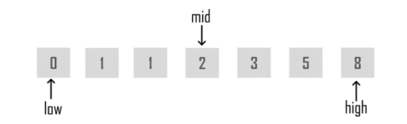

## Table of contents
* [General info](#general-info)
* [Technologies](#technologies)
* [Setup](#setup)

## General info
Practice

## Technologies
Project is created with:
* Gradle
* JAVA 15.0.1.
* lombok 1.18.20
* JUNIT5

## Setup
To run this project, install it locally using:

```
$ 
$ FORK from git
$ 
```

###Examples of complexity:


###Description for variables in BinarySearch
